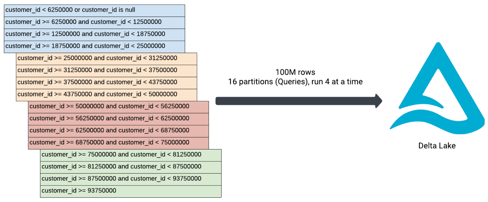

# Lakehouse Federation Ingestion Framework

Metadata-driven framework for ingesting data into Databricks using [Lakehouse Federation](https://docs.databricks.com/en/query-federation/index.html). Supports the following ingestion patterns:
- **Full**: ingests entire table
- **Incremental**: ingests incrementally using watermarks
- **Partitioned**: spreads ingestion across many small queries, run N at a time. Used for large tables. See diagram below.



The following sources are currently supported:
- SQL Server
- Oracle
- PostgreSQL
- Redshift
- Synapse

## Prerequisites

### 1. Setup Lakehouse Federation
Follow the [Lakehouse Federation](https://docs.databricks.com/en/query-federation/index.html) instructions to create a connection and foreign catalog

### 2. Install the Databricks CLI
Install the Databricks CLI from https://docs.databricks.com/dev-tools/cli/install.html

### 3. Authenticate to your Databricks workspace
Choose one of the following authentication methods:

#### Option A: Personal Access Token (PAT)

1. **Generate Personal Access Token:**
   - Log into your Databricks workspace
   - Click on your username in the top-right corner
   - Select **User Settings** → **Developer** → **Access tokens**
   - Click **Generate new token**
   - Give it a name (e.g., "Local Development") and set expiration
   - Copy the generated token

2. **Configure CLI with PAT:**
   ```bash
   databricks configure --token --profile DEFAULT
   ```
   
   You'll be prompted for:
   - **Databricks Host**: `https://your-workspace.cloud.databricks.com`
   - **Token**: Paste your generated token

    This will update DEFAULT profile in `~/.databrickscfg` 

#### Option B: OAuth Authentication

Configure OAuth:

```bash
databricks auth login --host https://your-workspace.cloud.databricks.com --profile PROD
```

This will:
- Open your browser for authentication
- Create a profile in `~/.databrickscfg`
- Store OAuth credentials securely

#### Verify Configuration

Check your configuration:

```bash
# List all profiles
cat ~/.databrickscfg
```

Your `~/.databrickscfg` should look like:

```ini
[DEFAULT]
host = https://your-workspace.cloud.databricks.com
token = dapi123abc...

[DEV]
host = https://dev-workspace.cloud.databricks.com
token = dapi456def...

[PROD]
host = https://prod-workspace.cloud.databricks.com
token = databricks-cli
```

### 4. Set up Python Virtual Environment
Create and activate a [Python virtual environment](https://realpython.com/python-virtual-environments-a-primer/) to manage dependencies:

```bash
# Create virtual environment on macOS/Linux
# See link above for Windows documentation
$ python3 -m venv .venv

# Activate virtual environment
$ source .venv/bin/activate

# Install required Python packages
$ pip install -r requirements-dev.txt
```

### 5. Configure databricks.yml Variables
Update the variables in `databricks.yml` to match your environment.

- **workspace.host**: Your Databricks workspace URL
- **cluster_id**: ID of your cluster for production deployment. For development, the bundle will lookup the ID based on the specified name (Eg, Shared Cluster).
- **warehouse_id**: ID of your SQL warehouse for production deployment. For development, the bundle will lookup the ID based on the specified name (Eg, Shared Serverless).
- **concurrency**: Concurrency of for each tasks. Can be overridden during deployment.

Example configuration for dev target:
```yaml
targets:
  dev:
    mode: development
    default: true
    workspace:
      host: https://your-workspace.cloud.databricks.com
    variables:
      cluster_id: your_cluster_id
      warehouse_id: your_warehouse_id
      concurrency: 16
```

## Getting Started

### 1. Add Metadata to Control Table
The solution is driven by metadata stored in a control table. In this table you can specific sources and sinks, loading behavior (Full, incremental, partitioned), etc.
1. Create the control table using the [_create_control_table](notebooks/_create_control_table.ipynb) notebook.
2. Merge metadata into the control table. See the [load_metadata_tpcds](notebooks/load_metadata_tpcds.ipynb) notebook for an example.

### 2. Configure Sources
Some sources require additional configuration in order to retrieve table sizes for partitioned ingestion:

**Oracle**  
Ingesting from Oracle requires permission to read the sys.dba_segments table. This is to obtain the source table size.

**PostgreSQL**  
The number of queries used for ingestion is determined in part by the size of the source table. Since Lakehouse Federation doesn't currently support PostgreSQL object size functions (E.g., pg_table_size), you need to create a view in the source database or use JDBC pushdown. **Creating a view in the source database is strongly recommended.**

1. Database view - create a view in the source database using the statement below. Leave the `jdbc_config_file` job parameter blank, and the view will be queried using Lakehouse Federation.

```sql
create or replace view public.vw_pg_table_size
 as
 select
  table_schema,
  table_name,
  pg_table_size(quote_ident(table_name)),
  pg_size_pretty(pg_table_size(quote_ident(table_name))) as pg_table_size_pretty
from information_schema.tables
where table_schema not in ('pg_catalog', 'information_schema')
and table_type = 'BASE TABLE';
```

2. JDBC pushdown - create a config file like [config/postgresql_jdbc.json](config/postgresql_jdbc.json). Use the path to the file as the value for the `jdbc_config_file` job parameter. [Secrets](https://docs.databricks.com/aws/en/security/secrets/) must be used for JDBC credentials. See [notebooks/manage_secrets.ipynb](notebooks/manage_secrets.ipynb) for reference.

### 3. Run Controller Job
1. Run the lakefed_ingest_controller job, providing the desired task_collection as a parameter.
2. The lakefed_ingest_controller job will run all non-partitioned tasks, followed by all partitioned tasks. Non-partitioned tasks run concurrently, and partitioned tasks run sequentially. This is because partitioned tasks will spawn concurrent queries, and we want to maintain a consistent level of concurrency at the controller job (And source system) scope.

### Recommendations
- Use a partition column with a relatively even distribution. If the partition column is also used in an index, that is even better.
- Use a small all-purpose cluster if you have partitioned ingestion tasks. This cluster is used only for configuring partitions (Not heavy data processing), and we don't want to wait for a job cluster to spin up for each partitioned ingestion task.

### Limitations
- Does not handle skew. The solution works best when the partition column has an even distribution.
- Does not provide atomicity. Individual queries are not executed as a single transaction. One could fail while the rest succeed, or the source table could be altered before all ingestion queries are completed.

## Deployment

### Deploy to Development Environment
```bash
$ databricks bundle deploy --target dev --profile DEFAULT
```
Note: Since "dev" is specified as the default target in databricks.yml, you can omit the `--target dev` parameter. Similarly, `--profile DEFAULT` can be omitted if you only have one profile configured for your workspace.

This deploys everything that's defined for this project, including:
- Three jobs prefixed with `lakefed_ingest_`
- main.py module for the partitioned ingest job
- All associated resources

You can find the deployed job by opening your workspace and clicking on **Workflows**.

### Deploy to Production Environment
```bash
$ databricks bundle deploy --target prod --profile PROD
```

### Run a Job
```bash
$ databricks bundle run --target prod --profile PROD
```

## Development Tools

For enhanced development experience, consider installing:
- Databricks extension for Visual Studio Code: https://docs.databricks.com/dev-tools/vscode-ext.html

## Documentation

For comprehensive documentation on:
- **Databricks Asset Bundles**: https://docs.databricks.com/dev-tools/bundles/index.html
- **CI/CD configuration**: https://docs.databricks.com/dev-tools/bundles/index.html

## Project Structure

- `src/`: Source files including notebooks, SQL files, and Python modules
- `resources/`: Bundle resource definitions (Jobs)
- `databricks.yml`: Main bundle configuration file
- `notebooks/`: Notebooks showing how to load metadata and work with Databricks Secrets

## Contributing

### 1. Create and Activate Virtual Environment
Follow the instructions above in the "Set up Python Virtual Environment" section.

### 2. Run Unit Tests

Databricks Connect is required to run some of the unit tests. 

1. Install dependent packages:
```
$ pip install -r requirements-dev.txt
```

2. Run unit tests with pytest
```
$ pytest
```

If you run into this error:
```
ERROR tests/main_test.py - Exception: Cluster id or serverless are required but were not specified.
```

Add the cluster_id to your .databrickscfg file
```
[DEFAULT]
host = https://your-workspace.cloud.databricks.com
cluster_id = XXXX-XXXXXX-XXXXXXXX
auth_type  = databricks-cli
```

## How to get help
Databricks support doesn't cover this content. For questions or bugs, please open a GitHub issue and the team will help on a best effort basis.

## License
&copy; 2025 Databricks, Inc. All rights reserved. The source in this notebook is provided subject to the [Databricks License](https://databricks.com/db-license-source). All included or referenced third party libraries are subject to the licenses set forth below.

| library | description | license | source |
|---------|-----------|-----------|------|
| pytest | Testing framework | MIT | [GitHub](https://github.com/pytest-dev/pytest) |
| setuptools | Build system | MIT | [GitHub](https://github.com/pypa/setuptools) |
| wheel | CLI for manipulating wheel files | MIT | [GitHub](https://github.com/pypa/wheel) |
| jsonschema | JSON schema validation | MIT | [GitHub](https://github.com/python-jsonschema/jsonschema) |
